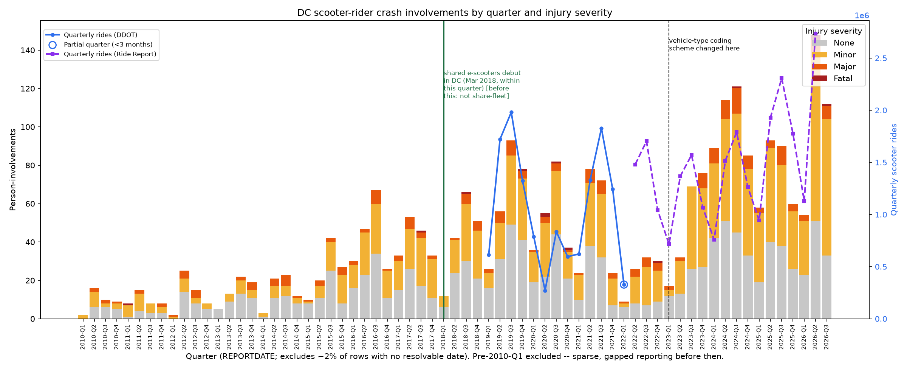

# DC e-scooter crash injuries

How many people are hurt on shared e-scooters in Washington, DC, and how has
that changed over time? This repo builds a quarterly injury time series
straight from DC's own public crash data, with ridership overlaid for
context, and documents every judgment call and data limitation along the way
so the methodology can be checked rather than taken on faith.



This chart (and the data behind it) supports a post on the *[Capital
Commonsense](https://capitalcommonsense.substack.com/p/capital-commonsense)* Substack. This repo
is the "show your work" -- everything here is meant to be reproducible by a
third party from public data.

## Quickstart

Requires [uv](https://docs.astral.sh/uv/).

```bash
git clone <this-repo-url>
cd capital_commonsense_escooter_safety
uv sync

uv run fetch-crash-data   # ~1-5 min: pulls DC's live crash-detail table (~900k rows) into data/raw/
uv run build-analysis     # filters to scooters, joins dates, aggregates, charts -> output/
```

`output/` will contain the chart plus the full set of CSVs it's built from
(person-level records, time series at month/quarter/year grain, and
breakdowns by age, impairment, speeding, ward, and vehicle-type coding), and
`output/DATA_NOTES.md`, a generated methodology doc reflecting the exact row
counts from your run (DC's crash data is live and grows continuously, so
re-running this will not reproduce the exact figures cited in the Substack
post -- see caveat there).

## What this actually measures

**Scooter-rider crash involvements, by injury severity, per quarter.** Not
"e-scooter share-program injuries" -- the underlying MPD data has no field
for vehicle ownership or rental-operator, so this necessarily also includes
some privately-owned scooters, gas mopeds, and (especially post-2020)
gig-delivery mopeds. See caveat 6 in `output/DATA_NOTES.md` for the full
reasoning; the chart marks DC's March 2018 shared e-scooter program debut as
a hard floor (nothing before it can be a shared device), not a clean
after-the-fact split.

A handful of other things worth knowing before citing this:

- DC changed its vehicle-type crash-coding scheme in 2023 (marked on the
  chart) -- both the old and new codes are counted as "scooter" here.
- Ridership is spliced from two different sources with two different
  methodologies (DDOT's own reporting through 2022-Q1, then Ride Report's
  public dashboard from 2022-Q2 on) -- they're visually distinguished on the
  chart, never blended into one line.
- Only ~14 fatalities total across the whole period -- don't read a trend
  into year-to-year noise in that series.

Full details, exact counts, and everything else: `output/DATA_NOTES.md`
(generated fresh each run) and the source comments in `build.py`.

## Data sources

| Dataset | Source | How it's used |
|---|---|---|
| Crash Details Table | [DDOT ArcGIS](https://maps2.dcgis.dc.gov/dcgis/rest/services/DCGIS_DATA/Public_Safety_WebMercator/MapServer/25) ([Open Data DC listing](https://opendata.dc.gov/datasets/DCGIS::crash-details-table/)) | Fetched live by `fetch_crash_data.py`. Person-level crash detail; no dates. |
| Crashes in DC | [DDOT ArcGIS](https://maps2.dcgis.dc.gov/dcgis/rest/services/DCGIS_DATA/Public_Safety_WebMercator/MapServer/24) ([Open Data DC listing](https://opendata.dc.gov/datasets/DCGIS::crashes-in-dc/)) | Queried live by `build.py`, joined on `CRIMEID`, for `REPORTDATE`/`WARD`. |
| DDOT monthly scooter ridership | [ddot.dc.gov/page/dockless-api](https://ddot.dc.gov/page/dockless-api) | Checked in at `data/reference/`; frozen historical publication, Jan 2019-Feb 2022. |
| Ride Report quarterly scooter stats | [public.ridereport.com/dc](https://public.ridereport.com/dc) | Checked in at `data/reference/`; hand-collected, no public API. See `data/reference/SOURCES.md`. |

Full provenance, access dates, and reliability caveats for the two checked-in
datasets: `data/reference/SOURCES.md`.

## Repo structure

```
src/dc_escooter_injuries/
    fetch_crash_data.py   # pulls the live Crash Details table -> data/raw/
    build.py               # filters, joins, aggregates, charts -> output/
data/
    raw/                    # gitignored; populated by fetch_crash_data.py
    reference/              # small checked-in datasets, see SOURCES.md
output/                     # generated: CSVs, chart, DATA_NOTES.md
tests/                       # see Testing below
```

## Testing

```bash
uv run pytest              # fast, no network: transform/aggregation logic + the
                            # checked-in reference CSVs. Runs in well under a second.
uv run pytest -m live       # hits DDOT's real ArcGIS endpoints, read-only, a
                            # handful of rows total -- confirms the two live
                            # endpoints this project depends on are still up
                            # and shaped the way the code expects. Excluded
                            # from the default run so nobody hits them by
                            # accident on every `pytest` invocation.
```

## License

Code: MIT, see `LICENSE`. Underlying data is public government data from
the District of Columbia (DDOT/MPD) and from Ride Report's public dashboard;
see `data/reference/SOURCES.md` for terms where noted.
